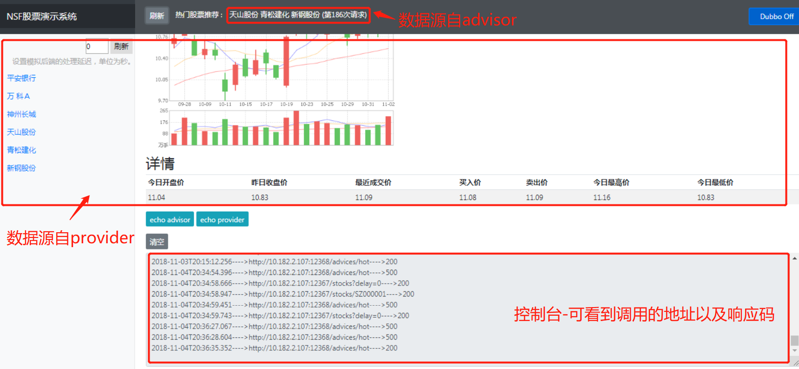

# NSF-SAMPLE详细设计文档

## 1. 背景
为模拟微服务架构，展现nsf微服务治理框架对微服务的治理能力，设计了一款股票应用。 

## 2. 架构

## 3. 设计说明
nsf-sample由三个微服务组成，分别为viewer、advisor、provider。

### 3.1 provider
提供股票的元数据，包括名字、买入价、收盘价、K线图等等。

### 3.2 advisor
从provider接收股票元数据，通过推荐系统计算出推荐的股票。

### 3.3 viewer
提供股票信息展示界面，调用advisor展示推荐股票信息，调用provider展示部分股票的基本信息。

viewer展示界面如下图所示：

